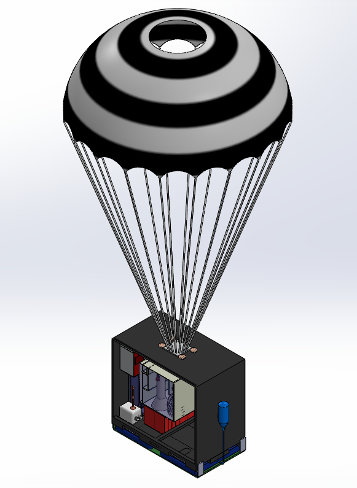
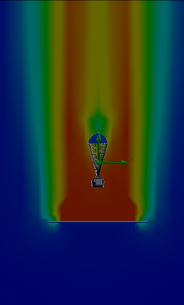
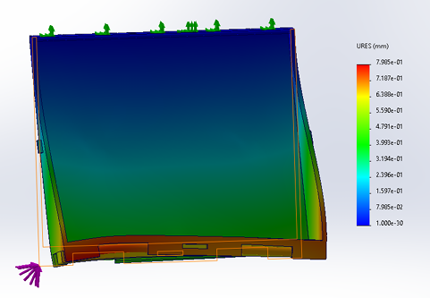
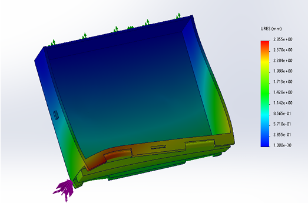
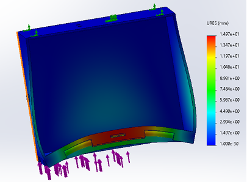
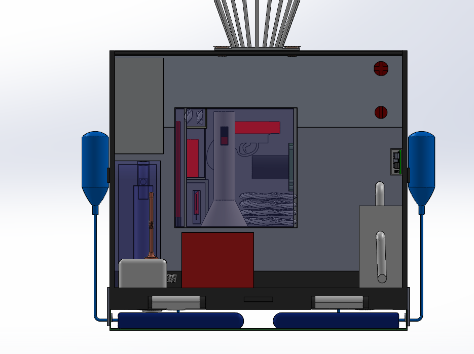

# Smart Modular Workstation for Disaster Relief

**🏆 Runner-Up — Vyoma Design-a-thon (Problem Statement 4)**

An air-deployable, modular field station designed to provide power, communication, medical support, and survival resources within minutes of a natural disaster striking a remote or infrastructure-damaged region.

*Full system with parachute deployed during descent phase*

---

## Overview

Floods, earthquakes, and other large-scale disasters routinely knock out local power, communication, and medical infrastructure right when they're needed most. This project designs a **75 kg air-droppable workstation** that can be delivered by helicopter or large drone and made fully operational within minutes of touchdown — no ground infrastructure required.

The system is split into four independent modules, each self-contained and field-serviceable:

| Module | Function |
|---|---|
| **1. Power & Communication** | LiPo battery bank, solar array, Raspberry Pi IoT dashboard, ham radio, satellite GPS |
| **2. Medical & Sustenance** | First-aid supplies, dehydrated food, compact water purification |
| **3. Survival Kit** | Tools, rope, fire starters, flare gun, thermal imaging camera |
| **4. Deployment Mechanism** | Parachute + airbag descent system engineered for a safe touchdown at up to 20 m/s |

---

## Key Features

- **Modular architecture** — each unit can be transported, serviced, or reconfigured independently
- **Hybrid power system** — solar panels + manual hand-crank generator for energy redundancy
- **Real-time telemetry** — Raspberry Pi 5 IoT dashboard tracks power, GPS, and occupancy data
- **Engineered descent system** — parachute + CO₂ airbags reduce terminal velocity from ~31 m/s to ~6.2 m/s
- **Rugged operating range** — functions from −10°C to 40°C, resistant to water, dust, and debris

---

## Engineering Analysis

### Descent & Impact Calculations
The team calculated terminal velocity using standard drag equations, then validated it against CFD simulation:

- Without parachute: **~30.7 m/s**
- With parachute deployed: **~6.2 m/s** (analytical) — confirmed by CFD at **~6 m/s**

*CFD velocity contour of the parachute-airbag descent phase*

### Structural Validation (FEA)
Static structural simulations were run for worst-case corner-impact scenarios at a design load of 30,000 N (vs. an actual estimated impact force of 7,500 N), giving a **Factor of Safety of 4.0**.

| Impact Case | Max Deformation | Result |
|---|---|---|
| One corner | 0.80 mm |  |
| Two corners | 1.83 mm |  |
| All four corners | 1.0 mm |  |

---

## Internal Layout

*Cutaway view showing the internal arrangement of survival kit, power system, and structural components*

---

## Mission Use Case

In the aftermath of a disaster, the workstation is air-dropped from ~1000 m altitude. Onboard GPS/IMU sensors guide it to the drop zone during descent; the parachute and airbag system bring it down safely. On landing, solar panels deploy automatically, satellite/ham radio links establish communication, and the IoT dashboard comes online — turning the unit into a mobile command center for relief teams to coordinate search, medical response, and drone-based aerial assessment.

---

## Tools & Technologies

`SolidWorks` `ANSYS Fluent (CFD)` `Finite Element Analysis (FEA)` `Raspberry Pi 5` `IoT Dashboard` `GPS/IMU Navigation`

---

## Team

Developed by **Akula Uday Kiran, Kiran V Airani, Shanthosh K V, and Tejas L** — Department of Aerospace Engineering, RV College of Engineering.

Submitted for the Vyoma Design-a-thon, Problem Statement 4 (May 2025).
